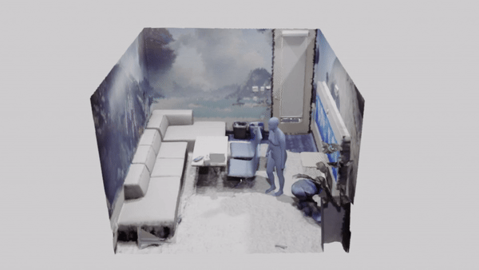

#  Purposer: 3D Motion Synthesis in Context
Code repository for the paper:
**Purposer: Putting Human Motion Generation in Context**

[Nicolas Ugrinovic](http://www.iri.upc.edu/people/nugrinovic), 
[Thomas Lucas](https://europe.naverlabs.com/people_user_naverlabs/thomas-lucas/), 
[Fabien Baradel](https://europe.naverlabs.com/people_user_naverlabs/fbaradel), 
[Philippe Weinzaepfel](https://europe.naverlabs.com/people_user_naverlabs/pweinzae), 
[Gregory Rogez](https://europe.naverlabs.com/people_user_naverlabs/grogez), 
[Francesc Moreno-Noguer](http://www.iri.upc.edu/people/fmoreno/), 


[](https://arxiv.org/pdf/2404.11987.pdf)  [](http://www.iri.upc.edu/people/nugrinovic/multiphys/)     




## Code comming soon...

[//]: # (## Installation)
[//]: # (First you need to clone the repo:)

[//]: # ()
[//]: # (```)

[//]: # (git clone https://github.com/nicolasugrinovic/multiphys.git)

[//]: # (cd multiphys)

[//]: # (```)

[//]: # ()
[//]: # (We recommend creating a virtual environment for MultiPhys. You can use conda:)

[//]: # ()
[//]: # (```bash)

[//]: # (conda create --name multiphys python=3.10)

[//]: # (conda activate multiphys)

[//]: # (```)

[//]: # ()
[//]: # (Then, you can install the rest of the dependencies:)

[//]: # (```bash)

[//]: # ()
[//]: # (```)

[//]: # ()
[//]: # (You also need to download the trained models:)

[//]: # (```bash)

[//]: # ()
[//]: # (```)

[//]: # ()
[//]: # ()
[//]: # (## Demo)

[//]: # (```)

[//]: # ()
[//]: # (```)

[//]: # ()
[//]: # (## Training)

[//]: # (```)

[//]: # ()
[//]: # (```)

[//]: # ()
[//]: # (## Acknowledgements)

[//]: # (Parts of the code are taken or adapted from the following repos:)

[//]: # (- [EmbodiedPose]&#40;https://github.com/zhengyiluo/EmbodiedPose&#41;)

[//]: # ()
[//]: # (## Citing)

[//]: # (If you find this code useful for your research, please consider citing the following paper:)

[//]: # ()
[//]: # (```bibtex)

[//]: # (@inproceedings{ugrinovic2024multiphys,)

[//]: # (                author={Ugrinovic, Nicolas and Pan, Boxiao and Pavlakos, Georgios and Yuan, Ye and Paschalidou, Despoina and Shen, Bokui and Sanchez-Riera, Jordi and Moreno-Noguer, Francesc and Guibas, Leonidas},)

[//]: # (                title={MultiPhys: Multi-Person Physics-aware 3D Motion Estimation},)

[//]: # (                booktitle={Conference on Computer Vision and Pattern Recognition &#40;CVPR&#41;},)

[//]: # (                year={2024})

[//]: # (})

[//]: # (```)